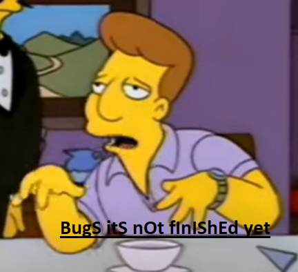

# Retardonator
MoSt BeSteERsT sCrITp ThAT hUMaNIty eVRE NEEdEd.

# dEsCrIptION
HTREe iS TiMeS wHeN YouR FirEndS aRe ATCiNg oR sYAiNgSgOMetHINg sTuPiD BuT tHSi ScIrpT is CoMiNg TO HtE ResCuE!

AlL wHAT ThIS CSRipT DOeS is raNdOmLy pRESsYsOur sHIFt To MAkE yURo tYpINg OLOk SA rETaDRARs pOssBILE.
TEHre IS oWn RaNdONmeSS To thEsE YTPSOaolSO.

SEe? wORkiNg alReDAy. 

WiTh sPeCAIL CHaArtCErs tHIS CsRiPT Is nTo FiNSIHED yET, sO InStEAd oF , iT mAy GIvE YOu ;

ON sNhI?T ThIs ScRiPT wAs DONEDEurInG LUnCh brEak. WAHT Do YoU eXPETeCD?

# iNsTLALAtiOn

cOPy/APTSe RO DoWNloAD sCRiPt AnDRDUN: pip install -r requirements.txt

# uSAgE

StRTAiNg: python retarded.py
sCrItP iTSLeF Is RuNNINg iN Own ComMaNd PRoMpT (FOr NOW) ANd WIlL LIsTEn FOlLOWinG HoTkESy:

alt + q: "live" retarding (careful with special characters)
- rEtRAdInG WilL sTop lVIe moDe afTeR PrSESiNG ENtEr Or HTOkEy agAin.

alt + a: if you have text in clipboard, it will change it to look more retarded (no typos implemented).

esc: shutdown script
